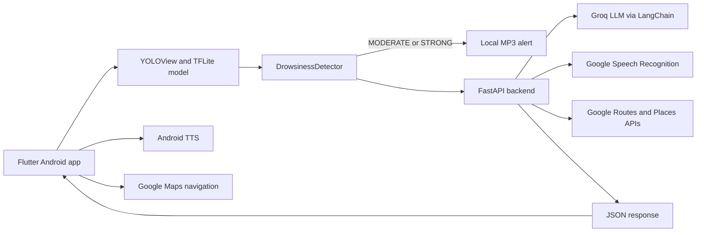

# AI Voice Co-Pilot

An experimental driver-safety assistant that combines on-device computer vision with a conversational voice co-pilot. The Flutter Android app monitors driver-facing camera detections for signs of fatigue, while a Python FastAPI service handles conversational responses, speech transcription, and route-aware rest-stop discovery.

> **Safety notice:** This project is a prototype and is not a certified automotive, medical, or emergency-safety system. It can produce false positives or miss signs of drowsiness. Drivers must remain responsible for safe driving and should stop in a safe location whenever they feel tired.

## What It Does

- Collects a vehicle type and destination before a monitoring session.
- Runs a custom YOLO TensorFlow Lite model locally in the Flutter app.
- Tracks eye closure, PERCLOS, head position, and yawns over time.
- Plays a local audio alert when moderate or strong fatigue is detected.
- Uses GPS coordinates and the configured destination to search for places along the route.
- Speaks AI-generated responses through Android text-to-speech.
- Records an eight-second WAV response during the moderate-fatigue dialogue loop.
- Sends the recording to the FastAPI backend for Google Speech Recognition transcription.
- Opens Google Maps navigation externally when a suitable stop is found.

## Architecture



### Runtime flow

1. `TripSetupScreen` validates the vehicle type and destination.
2. `CameraPage` loads `assets/yolo11n_best.tflite` through `YOLOView`.
3. `DrowsinessDetector` converts model labels into `NORMAL`, `MODERATE`, or `STRONG` states.
4. The app posts a multipart form request to `/api/drowsiness/trigger`.
5. A strong event searches for route stops immediately. A moderate event starts a voice conversation.
6. The app speaks `speak_text` and navigates to a selected stop when the response contains stops.

The backend keeps conversation history and refusal counts in memory, keyed by `session_id`. Restarting the server clears that state.

## Repository Layout

```text
.
├── ai_voice_copilot.py       # Conversational safety agent and event workflow
├── route_planner.py          # Google Routes/Places integration and distance sorting
├── server.py                 # FastAPI application and HTTP endpoints
├── pyproject.toml            # Python project metadata and dependencies
├── uv.lock                   # Locked Python dependency resolution
├── src/project_code/         # Package entry point for the generated project script
└── ai copilot app/
		├── lib/main.dart         # Flutter UI, detector, audio, GPS, and API client
		├── assets/                # TFLite model, labels, and alert audio
		├── test/                  # Flutter widget tests
		└── android/               # Android host, permissions, and Gradle configuration
```

Generated Flutter and Android build directories are not source and are excluded from version control. The `yolo26n_best.tflite` file is present in the repository but is not currently declared as a Flutter asset or referenced by the app.

## Requirements

### Backend

- Windows, macOS, or Linux
- Python 3.14, as declared in `.python-version` and `pyproject.toml`
- [uv](https://docs.astral.sh/uv/)
- A Groq API key
- A Google Maps Platform API key with the Routes API and Places API enabled

### Android client

- Flutter with Dart 3.13.1 or compatible
- Android Studio or an Android SDK installation
- Android SDK compile level 37
- Java/Kotlin 17
- A physical Android device or an Android emulator with a camera

Camera, microphone, location, Internet access, and Google Maps navigation are required for the complete experience.

## Configuration

Create a `.env` file in the repository root. Do not commit it:

```dotenv
GROQ_API_KEY=your_groq_api_key
MAPS_API_KEY=your_google_maps_api_key
```

The backend loads these values with `python-dotenv` when `RoutePlanner` and `DrowsinessSafetyAgent` are initialized.

Set the Flutter backend URL in `ai copilot app/lib/main.dart`:

```dart
const String kBackendBaseUrl = "http://10.0.2.2:8000";
```

Use `10.0.2.2` from an Android emulator. For a physical device, use the development computer's local network IP, for example `http://192.168.1.20:8000`, and ensure both devices are on the same network. The Android manifest currently permits cleartext HTTP for local development; use HTTPS and a proper production network policy before deployment.

## Installation

From the repository root:

```powershell
uv sync
```

Then install Flutter dependencies:

```powershell
Set-Location "ai copilot app"
flutter pub get
```

The backend imports `requests` directly from `route_planner.py`, but `requests` is not currently listed in `pyproject.toml`. Add it to the project dependencies before relying on a clean environment:

```powershell
Set-Location ..
uv add requests
```

## Running the Project

### Start the backend

From the repository root:

```powershell
uv run uvicorn server:app --reload --host 0.0.0.0 --port 8000
```

The API is then available at `http://localhost:8000`. FastAPI's interactive documentation is available at `http://localhost:8000/docs`.

### Start the Android app

In a second terminal:

```powershell
Set-Location "ai copilot app"
flutter run
```

On first use, grant the requested camera, microphone, and location permissions. Enter a destination, proceed to monitoring, and press `START` to begin inference.

## API Reference

### `POST /api/drowsiness/trigger`

Accepts form-encoded fields:

| Field | Type | Description |
| --- | --- | --- |
| `drowsiness_level` | string | `MODERATE` or `STRONG` as emitted by the app |
| `start_lat` | number | Current latitude |
| `start_lon` | number | Current longitude |
| `destination` | string | User-entered destination address or place |
| `session_id` | string | Optional conversation key; defaults to `driver_session` |

Example:

```powershell
curl.exe -X POST http://localhost:8000/api/drowsiness/trigger `
	-F "drowsiness_level=MODERATE" `
	-F "start_lat=19.2467" `
	-F "start_lon=73.1204" `
	-F "destination=Dombivli, Maharashtra, India" `
	-F "session_id=driver_session"
```

Response shape:

```json
{
	"speak_text": "A short spoken response",
	"continue_dialogue": true,
	"stops": []
}
```

### `POST /api/drowsiness/respond-voice`

Accepts multipart form data with the same location, destination, and session fields plus an `audio_file` WAV upload. The server transcribes the audio with Google Speech Recognition and sends the resulting text through the LangChain/Groq workflow.

When transcription fails, the endpoint returns a retry prompt with `continue_dialogue: true` rather than raising an API error.

## Detection Logic

The client maintains a 60-second eye-closure buffer. The model labels are defined in `ai copilot app/assets/labels.txt`:

```text
eye_closed
eye_open
head_dropped
head_straight
no_yawn
yawn
```

Current thresholds in `DrowsinessDetector` are:

| State | Condition |
| --- | --- |
| `STRONG` | Eyes continuously closed for at least 3 seconds and PERCLOS is at least 25% |
| `STRONG` | Head dropped for at least 3 seconds while eyes are closed |
| `MODERATE` | PERCLOS is 20% to below 25% and at least three valid yawns occurred within two minutes |
| `NORMAL` | All other cases |

Valid yawns last between three and eight seconds. A 15-second client cooldown prevents repeated backend triggers after an alert.

## Assets

| Asset | Purpose | Status |
| --- | --- | --- |
| `yolo11n_best.tflite` | On-device object detection model | Declared and used |
| `labels.txt` | Model class labels | Declared and used |
| `moderate_level.mp3` | Moderate-fatigue alert | Declared and used |
| `strong_level.mp3` | Strong-fatigue alert | Declared and used |
| `yolo26n_best.tflite` | Additional model file | Present but currently unused |

## Route Stop Selection

The backend uses Google Routes API to retrieve an encoded driving route, then Google Places API to search for the requested place type along that route. Results are normalized, filtered to the forward direction when the destination can be geocoded, and sorted by Haversine distance from the current location.

The Flutter client prefers the first result between 2 km and 10 km away. If none is in that range, it falls back to the first returned result, then opens Google Maps through an Android navigation deep link or a web fallback.

## Validation

Run Flutter static analysis and tests from the Flutter directory:

```powershell
Set-Location "ai copilot app"
flutter analyze
flutter test
```

The repository currently contains only a basic widget test and no backend unit or API integration tests. The existing widget test expects monitoring controls on the initial screen, while the app initially displays `TripSetupScreen`; update the test or navigate through trip setup before treating the test as a reliable acceptance check.

## Limitations and Privacy

- Detection quality depends on camera placement, lighting, model quality, and device performance.
- The vehicle type is collected for display but does not currently change detection or backend behavior.
- The backend uses in-memory session state and has no authentication, rate limiting, or persistent storage.
- Audio is uploaded to the backend and transcribed through Google Speech Recognition. Location and destination data are sent to the backend and Google Maps services for route planning.
- API credentials are read from environment variables and should never be embedded in the Flutter application.
- The Android release configuration currently uses the debug signing key and should not be used for production distribution.
- The current backend does not explicitly reject unknown drowsiness levels; callers should send only `MODERATE` or `STRONG`.
- This project does not replace rest, human judgment, or emergency services.

## License

See [LICENSE](LICENSE) for the repository license.
